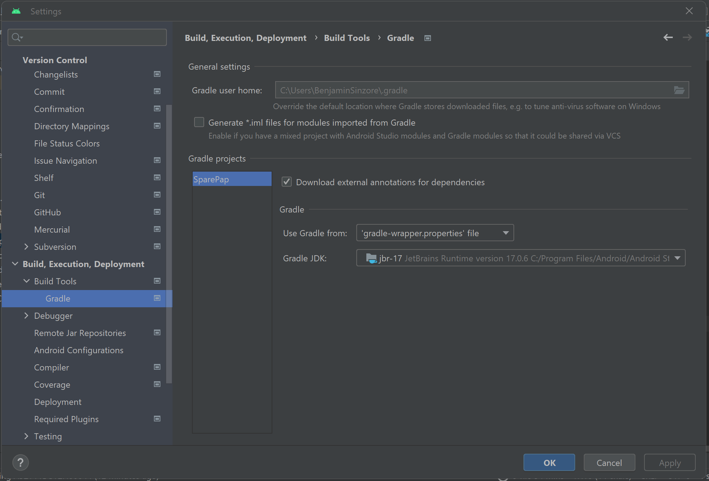
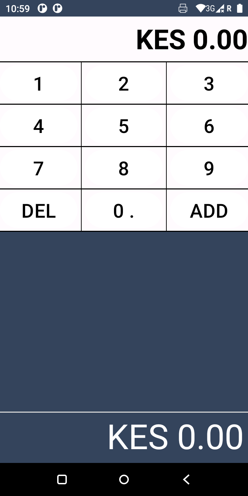
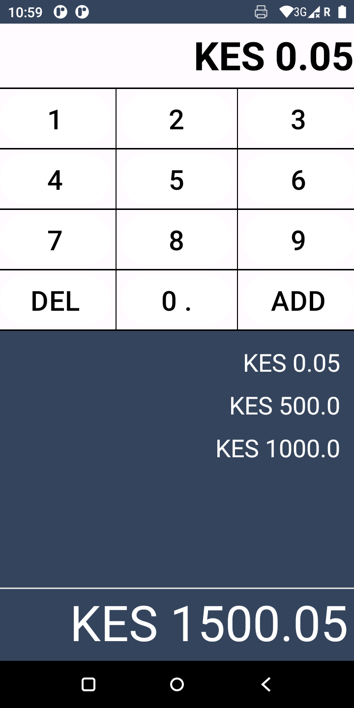

# SparePap Take-home Assignment
Android Application for the purpose of fulfilling the interview process at SparePap. Developed by Benjamin Sinzore.

## LINK: Github
### https://github.com/benjiesinzore/SparePap-Assignment

## Running the Project

To ensure the project runs on your local environment ensure you have Java 17 on your PC or if you
don't have you can install it
from [here](https://www.oracle.com/java/technologies/javase/jdk17-archive-downloads.html).

If you have multiple installations of Java make sure to set Java 17 as your preferred version to run
the project.

With the new Android Gradle Plugin version 8.0.2, you need Java 17 to run the project and any
terminal commands. A workaround for this is to add this in your **global** gradle.properties file:

## Dependencies
1. Lifecycle - To manage the state of the application in realtime
2. Room Database - Used as an abstraction of SQLite in Android Applications

## Architecture

The proposed architecture is as follows;

### Adapter
 Contains the ListAdapter and the ViewHolder, also data mapping is done here
 

### Data Access Layer
 Contains the following: DAO, and the Database class called RoomDatabase
 

### Data View Layer
 Contains: Repository, and the DataViewModel
 

### Models
 Contains: Data entity
 

### Images.

